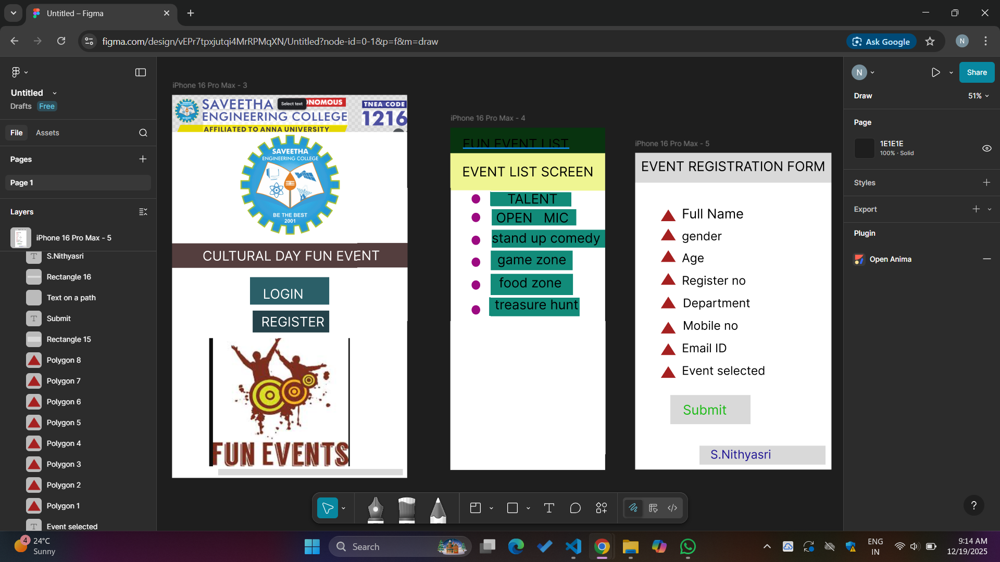

# Ex08 Event Registration Web Application
## Date:23.12.2025

## AIM:
To design, develop and deploy a web application for event registration using Figma UI tool.

## UI DESIGN TOOL:
Figma

## DESIGN STEPS:

### Step 1:
Use frames to represent screens or sections.

### Step 2:
Add column grids for consistent spacing and alignment.

### Step 3:
Insert shapes, text, buttons, and icons.

### Step 4:
Use Auto Layout for flexible, responsive design.

### Step 5:
Define color, text, and effect styles globally for consistency.

### Step 6:
Name layers logically and group related elements.

### Step 6:
Link frames to show navigation or interactions.

### Step 7:
Select the specific frame while generating code using Anima plugin.

## CODE:
```
<!DOCTYPE html>
<html>
  <head>
    <meta name="viewport" content="width=device-width, initial-scale=1" />
    <meta charset="utf-8" />
    <link rel="stylesheet" href="globals.css" />
    <link rel="stylesheet" href="style.css" />
  </head>
  <body>
    <div class="iPhone 16 pro max">
      
      <div class="group"></div>
      <div class="div"></div>
      <div class="text-wrapper">LOGIN</div>
      
      <div class="text-wrapper-2">REGISTER</div>
      <div class="rectangle-2"></div>
      <div class="text-wrapper-3"></div>
      
    </div>
  </body>
</html>

@import url("https://cdnjs.cloudflare.com/ajax/libs/meyer-reset/2.0/reset.min.css");
* {
  -webkit-font-smoothing: antialiased;
  box-sizing: border-box;
}
html,
body {
  margin: 0px;
  height: 100%;
}
/* a blue color as a generic focus style */
button:focus-visible {
  outline: 2px solid #4a90e2 !important;
  outline: -webkit-focus-ring-color auto 5px !important;
}
a {
  text-decoration: none;
}

.iPhone 16 pro max.rectangle{
  background-color: #ffffff;
  overflow: hidden;
  width: 100%;
  min-width: 430px;
  min-height: 885px;
  position: relative;
}

.iPhone 16 pro max.rectangle{

  position: absolute;
  top: 13px;
  left: 31px;
  width: 353px;
  height: 85px;
  object-fit: cover;
}

.iPhone 16 pro max.rectangle{

  position: absolute;
  top: 110px;
  left: 63px;
  width: 290px;
  height: 278px;
  background-image: url(./img/rectangle-2.png);
  background-size: cover;
  background-position: 50% 50%;
}

. iPhone 16 pro max .div {
  position: absolute;
  top: 498px;
  left: 65px;
  width: 322px;
  height: 58px;
  background-color: #f5108a;
}

.iPhone 16 pro max.text-wrapper {
  position: absolute;
  top: 508px;
  left: 168px;
  width: 117px;
  font-family: "Inter-Black", Helvetica;
  font-weight: 900;
  color: #000000;
  font-size: 32px;
  letter-spacing: 0;
  line-height: normal;
  white-space: nowrap;
}

.iphone16 pro max .img {
  position: absolute;
  top: 578px;
  left: 63px;
  width: 333px;
  height: 59px;
}

.iPhone 16 pro max.text-wrapper-2 {
  position: absolute;
  top: 591px;
  left: 147px;
  width: 250px;
  font-family: "Inter-Black", Helvetica;
  font-weight: 900;
  color: #000000;
  font-size: 32px;
  letter-spacing: 0;
  line-height: normal;
  white-space: nowrap;
}

.iPhone 16 pro max .rectangle-2 {
  position: absolute;
  top: 413px;
  left: 21px;
  width: 412px;
  height: 82px;
  background-color: #0ed1df;
}

.iPhone 16 pro max .text-wrapper-3 {
  position: absolute;
  top: 434px;
  left: 49px;
  font-family: "Inter-Black", Helvetica;
  font-weight: 900;
  color: #000000;
  font-size: 32px;
  letter-spacing: 0;
  line-height: normal;
}

.iPhone 16 pro max.rectangle-3 {
  position: absolute;
  top: 662px;
  left: 76px;
  width: 327px;
  height: 184px;
}

<!DOCTYPE html>
<html>
  <head>
    <meta name="viewport" content="width=device-width, initial-scale=1" />
    <meta charset="utf-8" />
    <link rel="stylesheet" href="globals.css" />
    <link rel="stylesheet" href="style.css" />
  </head>
  <body>
    <div class="iphone-pro-max">
      
      <div class="text-wrapper">CULTURAL DAY FUN EVENT</div>
      
      
      <div class="div">Talent</div>
      <div class="text-wrapper-2">Open mic</div> 
      
      
      
      <div class="text-wrapper-3">Stand Up Comedy</div> 
      
      <div class="text-wrapper-4">
      
       <div class="text-wrapper-3">Game Zone</div> 
      

      <div class="text-wrapper-5">Food Zone</div>
      
      <div class="text-wrapper-6">Treasure Hunt</div>
      
    </div>
  </body>
</html>

@import url("https://cdnjs.cloudflare.com/ajax/libs/meyer-reset/2.0/reset.min.css");
* {
  -webkit-font-smoothing: antialiased;
  box-sizing: border-box;
}
html,
body {
  margin: 0px;
  height: 100%;
}
/* a blue color as a generic focus style */
button:focus-visible {
  outline: 2px solid #4a90e2 !important;
  outline: -webkit-focus-ring-color auto 5px !important;
}
a {
  text-decoration: none;
}

.iPhone 16 pro max {
  background-color: #ffffff;
  overflow: hidden;
  width: 100%;
  min-width: 440px;
  min-height: 885px;
  position: relative;
}

.iPhone 16 pro max .text-on-a-path {
  position: absolute;
  top: -53px;
  left: -467px;
  width: 386px;
  height: 64px;
}

.iPhone 16 pro max .text-wrapper {3
  position: absolute;
  top: 58px;
  left: 65px;
  font-family: "Inter-Black", Helvetica;
  font-weight: 900;
  color: #000000;
  font-size: 32px;
  letter-spacing: 0;
  line-height: normal;
}

.iPhone 16 pro max .star {
  position: absolute;
  top: 154px;
  left: 56px;
  width: 18px;
  height: 24px;
}

.iPhone 16 pro max .img {
  position: absolute;
  top: 205px;
  left: 56px;
  width: 18px;
  height: 24px;
}

.iPhone 16 pro max  .div {
  position: absolute;
  top: 150px;
  left: 94px;
  font-family: "Inter-Black", Helvetica;
  font-weight: 900;
  color: #000000;
  font-size: 32px;
  letter-spacing: 0;
  line-height: normal;
}

.iPhone 16 pro max .text-wrapper-2 {
  position: absolute;
  top: 201px;
  left: 94px;
  width: 254px;
  font-family: "Inter-Black", Helvetica;
  font-weight: 900;
  color: #000000;
  font-size: 32px;
  letter-spacing: 0;
  line-height: normal;
}

.iPhone 16 pro max  .star-2 {
  position: absolute;
  top: 256px;
  left: 56px;
  width: 17px;
  height: 24px;
}

.iPhone 16 pro max  .text-wrapper-3 {
  position: absolute;
  top: 252px;
  left: 94px;
  width: 201px;
  font-family: "Inter-Black", Helvetica;
  font-weight: 900;
  color: #000000;
  font-size: 32px;
  letter-spacing: 0;
  line-height: normal;
}

.iphone-pro-max .star-3 {
  position: absolute;
  top: 312px;
  left: 56px;
  width: 18px;
  height: 24px;
}

.iPhone 16 pro max .text-wrapper-4 {
  position: absolute;
  top: 307px;
  left: 94px;
  width: 125px;
  font-family: "Inter-Black", Helvetica;
  font-weight: 900;
  color: #000000;
  font-size: 32px;
  letter-spacing: 0;
  line-height: normal;
}

.iPhone 16 pro max  .star-4 {
  position: absolute;
  top: 357px;
  left: 56px;
  width: 17px;
  height: 23px;
}

.iPhone 16 pro max .text-wrapper-5 {
  position: absolute;
  top: 351px;
  left: 94px;
  font-family: "Inter-Black", Helvetica;
  font-weight: 900;
  color: #000000;
  font-size: 32px;
  letter-spacing: 0;
  line-height: normal;
}

.iPhone 16 pro max .star-5 {
  position: absolute;
  top: 406px;
  left: 57px;
  width: 18px;
  height: 18px;
}

.iPhone 16 pro max .text-wrapper-6 {
  position: absolute;
  top: 399px;
  left: 94px;
  width: 188px;
  font-family: "Inter-Black", Helvetica;
  font-weight: 900;
  color: #000000;
  font-size: 32px;
  letter-spacing: 0;
  line-height: normal;
}

.iPhone 16 pro max .rectangle {
  position: absolute;
  top: 457px;
  left: 33px;
  width: 318px;
  height: 350px;
  object-fit: cover;
}

<!DOCTYPE html>
<html>
  <head>
    <meta name="viewport" content="width=device-width, initial-scale=1" />
    <meta charset="utf-8" />
    <link rel="stylesheet" href="globals.css" />
    <link rel="stylesheet" href="style.css" />
  </head>
  <body>
    <div class="iphone-pro-max">
      <div class="text-wrapper">CULTURAL DAY FUN EVENT</div>
      
      
      
      <div class="rectangle"></div>
      <div class="div">FULL NAME</div>
      <div class="rectangle-2"></div>
      <div class="text-wrapper-2">GENDER</div>
      
      <div class="text-wrapper-3">AGE</div>
      <div class="rectangle-4"></div>
      <div class="text-wrapper-4">REGISTER NO</div>
      
      <div class="rectangle-5"></div>
      <div class="text-wrapper-5">DEPARTMENT</div>
      <div class="rectangle-6"></div>
      <div class="text-wrapper-6">MOBILE NO</div>
      <div class="rectangle-7"></div>
      <div class="text-wrapper-7">EMAIL</div>
      
      <div class="rectangle-8"></div>
      <div class="text-wrapper-8">EVENT SELECTED </div>
      <div class="rectangle-9"></div>
      <div class="text-wrapper-9">SUBMIT</div>
      
    </div>
  </body>
</html>

@import url("https://cdnjs.cloudflare.com/ajax/libs/meyer-reset/2.0/reset.min.css");
* {
  -webkit-font-smoothing: antialiased;
  box-sizing: border-box;
}
html,
body {
  margin: 0px;
  height: 100%;
}
/* a blue color as a generic focus style */
button:focus-visible {
  outline: 2px solid #4a90e2 !important;
  outline: -webkit-focus-ring-color auto 5px !important;
}
a {
  text-decoration: none;
}

.iPhone 16 pro max .text-wrapper {
  background-color: #ffffff;
  overflow: hidden;
  width: 100%;
  min-width: 422px;
  min-height: 881px;
  position: relative;
}

.iPhone 16 pro max .text-wrapper {
  position: absolute;
  top: 69px;
  left: 48px;
  font-family: "Inter-Black", Helvetica;
  font-weight: 900;
  color: #000000;
  font-size: 32px;
  letter-spacing: 0;
  line-height: normal;
}

.iPhone 16 pro max .text-on-a-path {
  position: absolute;
  top: 48px;
  left: -912px;
  width: 262px;
  height: 44px;
}

.iPhone 16 pro max .img {
  position: absolute;
  top: 42px;
  left: -925px;
  width: 275px;
  height: 50px;
}

.iPhone 16 pro max .text-on-a-path-2 {
  position: absolute;
  top: 48px;
  left: -912px;
  width: 251px;
  height: 44px;
}

.iPhone 16 pro max .rectangle {
  position: absolute;
  top: 123px;
  left: 71px;
  width: 171px;
  height: 44px;
  background-color: #d9d9d9;
}

.iPhone 16 pro max .div {
  position: absolute;
  top: 132px;
  left: 79px;
  width: 132px;
  font-family: "Inter-ExtraBold", Helvetica;
  font-weight: 800;
  color: #000000;
  font-size: 20px;
  letter-spacing: 0;
  line-height: normal;
}

.iPhone 16 pro max  .rectangle-2 {
  position: absolute;
  top: 176px;
  left: 71px;
  width: 171px;
  height: 55px;
  background-color: #d9d9d9;
}

.iPhone 16 pro max .text-wrapper-2 {
  position: absolute;
  top: 189px;
  left: 79px;
  width: 100px;
  font-family: "Inter-ExtraBold", Helvetica;
  font-weight: 800;
  color: #000000;
  font-size: 20px;
  letter-spacing: 0;
  line-height: normal;
}

.iPhone 16  pro max .rectangle-3 {
  position: absolute;
  top: 245px;
  left: 71px;
  width: 171px;
  height: 54px;
}

.iPhone 16 pro max  .text-wrapper-3 {
  position: absolute;
  top: 255px;
  left: 79px;
  width: 66px;
  font-family: "Inter-ExtraBold", Helvetica;
  font-weight: 800;
  color: #000000;
  font-size: 20px;
  letter-spacing: 0;
  line-height: normal;
}

.iPhone 16 pro max .rectangle-4 {
  position: absolute;
  top: 315px;
  left: 71px;
  width: 171px;
  height: 51px;
  background-color: #d9d9d9;
}

.iPhone 16 pro max .text-wrapper-4 {
  position: absolute;
  top: 327px;
  left: 71px;
  width: 154px;
  font-family: "Inter-ExtraBold", Helvetica;
  font-weight: 800;
  color: #000000;
  font-size: 20px;
  letter-spacing: 0;
  line-height: normal;
}

.iPhone 16 pro max .text-on-a-path-3 {
  position: absolute;
  top: 305px;
  left: -912px;
  width: 171px;
  height: 46px;
}

.iPhone 16 pro max  .rectangle-5 {
  position: absolute;
  top: 380px;
  left: 71px;
  width: 171px;
  height: 46px;
  background-color: #d9d9d9;
}

.iPhone 16 pro max .text-wrapper-5 {
  position: absolute;
  top: 393px;
  left: 79px;
  width: 148px;
  font-family: "Inter-ExtraBold", Helvetica;
  font-weight: 800;
  color: #000000;
  font-size: 20px;
  letter-spacing: 0;
  line-height: normal;
  white-space: nowrap;
}

.iPhone 16 pro max  .rectangle-6 {
  position: absolute;
  top: 441px;
  left: 71px;
  width: 171px;
  height: 57px;
  background-color: #d9d9d9;
}

.iPhone 16 pro max .text-wrapper-6 {
  position: absolute;
  top: 450px;
  left: 79px;
  width: 146px;
  font-family: "Inter-ExtraBold", Helvetica;
  font-weight: 800;
  color: #000000;
  font-size: 20px;
  letter-spacing: 0;
  line-height: normal;
}

.iPhone 16 pro max  .rectangle-7 {
  position: absolute;
  top: 511px;
  left: 71px;
  width: 171px;
  height: 56px;
  background-color: #d9d9d9;
}

.iPhone 16 pro max .text-wrapper-7 {
  position: absolute;
  top: 522px;
  left: 79px;
  width: 81px;
  font-family: "Inter-ExtraBold", Helvetica;
  font-weight: 800;
  color: #000000;
  font-size: 20px;
  letter-spacing: 0;
  line-height: normal;
}

.iPhone 16 pro max .text-on-a-path-4 {
  position: absolute;
  top: 510px;
  left: -912px;
  width: 171px;
  height: 53px;
}

.iPhone 16 pro max  .rectangle-8 {
  position: absolute;
  top: 583px;
  left: 71px;
  width: 171px;
  height: 88px;
  background-color: #d9d9d9;
}

.iPhone 16 pro max .text-wrapper-8 {
  position: absolute;
  top: 596px;
  left: 79px;
  width: 163px;
  font-family: "Inter-ExtraBold", Helvetica;
  font-weight: 800;
  color: #000000;
  font-size: 20px;
  letter-spacing: 0;
  line-height: normal;
}

.iPhone 16 pro max.rectangle-9 {
  position: absolute;
  top: 702px;
  left: 87px;
  width: 166px;
  height: 47px;
  background-color: #30a147ff;
}

.iPhone 16 pro max.text-wrapper-9 {

  position: absolute;
  top: 714px;
  left: 112px;
  width: 141px;
  transform: rotate(0.82deg);
  font-family: "Inter-ExtraBold", Helvetica;
  font-weight: 800;
  color: #ffffff;
  font-size: 20px;
  letter-spacing: 0;
  line-height: normal;
}

.iPhone 16 pro max .rectangle-10 {
  position: absolute;
  top: 596px;
  left: 266px;
  width: 136px;
  height: 267px;
  object-fit: cover;
}
```

## OUTPUT:



## RESULT:
The program to design, develop and deploy a web application for event registration using Figma UI tool is completed successfully.
